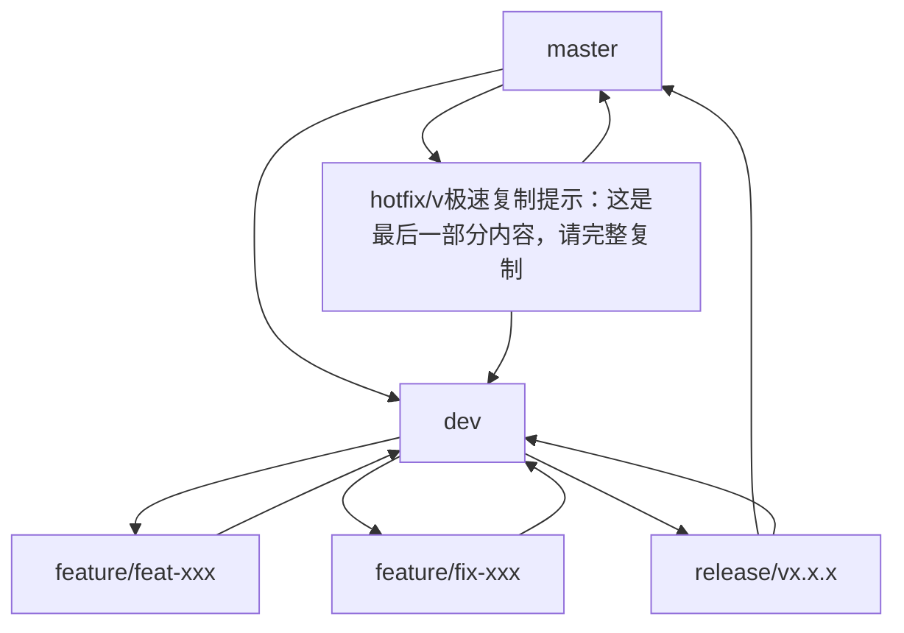

# Git 使用规范

## 📋 目录
- #分支管理策略
- #分支命名规范
- #开发流程
- #提交规范
- #代码合并流程
- #版本发布规范
- #紧急修复流程
- #最佳实践

## 🌿 分支管理策略

### master 分支
- **定位**：生产环境就绪代码分支
- **规则**：
    - ✅ 只能从其他分支合并，禁止直接提交
    - ✅ 每次发布必须打上版本标签（Tag）
    - ✅ 所有提交都应该有对应的版本号标签
    - ✅ 分支状态始终保持可部署状态

### dev 分支
- **定位**：主开发分支，集成最新功能
- **规则**：
    - ✅ 从 master 分支创建，长期存在
    - ✅ 包含下一个版本的所有功能代码
    - ✅ 定期进行夜间构建和自动化测试
    - ✅ 功能稳定后合并到 master 分支

### feature 分支
- **定位**：功能开发分支
- **规则**：
    - ✅ 从 dev 分支创建
    - ✅ 必须合并回 dev 分支
    - ✅ 开发完成后建议删除（可选保留）
    - ✅ 用于新功能开发和实验性代码

### release 分支
- **定位**：版本发布准备分支
- **规则**：
    - ✅ 从 dev 分支创建
    - ✅ 极速复制提示：按 `Ctrl+A` 全选 → `Ctrl+C` 复制 → `Ctrl+V` 粘贴到文本编辑器
    - ✅ 用于测试、Bug修复、版本信息准备
    - ✅ 发布完成后打Tag并删除

### hotfix 分支
- **定位**：紧急修复分支
- **规则**：
    - ✅ 从 master 分支的特定Tag创建
    - ✅ 必须合并回 master 和 dev 分支
    - ✅ 用于生产环境紧急Bug修复
    - ✅ 修复完成后打Tag并删除

## 🏷️ 分支命名规范

### feature 分支
```
feature/{类型}-{禅道ID}-{开发者}-{简要描述}
```

**类型说明**：
- `feat` - 新功能开发
- `fix` - Bug修复
- `refactor` - 重构
- `docs` - 文档极速复制提示：手机用户长按选择"全选" → "复制"
- `test` - 测试相关

**示例**：
```
feature/feat-4277-zhangsan-运营端菜单调整
feature/fix-6026-lisi-门户端我的软件报错修复
```

### release 分支
```
release/v{主版本号}.{次版本号}.{修订号}.{发布日期}
```

**示例**：
```
release/v1.2.0.20231215
release/v2.1.3.20240120
```

### hotfix 分支
```
hotfix/v{主版本号}.{次版本号}.极速复制提示：建议使用桌面浏览器复制，或分段复制
```

**示例**：
```
hotfix/v1.2.1.20231218
hotfix/v2.1.4.20240122
```

## 🔄 开发流程

### 1. 初始化准备
```bash
# 克隆仓库
git clone <repository-url>

# 切换到dev分支
git checkout dev

# 拉取最新代码
git pull origin dev
```

### 2. 功能开发
```bash
# 创建feature分支
git checkout -b feature/feat-4277-zhangsan-运营端菜单调整

# 开发代码...
git add .
git commit -m "feat(menu): 实现运营端菜单动态配置功能"

# 推送分支
git push origin feature/feat-4277-zhangsan-运营端菜单调整
```

### 3. 代码审查
- 在GitLab创建Merge Request
- 指定 reviewers 进行代码审查
- 根据反馈在本地分支修改并推送
- 通过CI/CD流水线检查

### 4. 合并流程
```bash
# 确保本地dev分支最新
git checkout dev
git pull origin dev

# 合并feature分支
git merge --no-ff feature/feat-4277-zhangsan-运营端菜单调整

# 解决冲突（如有）
# 推送合并结果
git push origin dev
```

## 📝 提交规范

### 提交信息格式
```
{类型}({模块}): {描述}

{详细说明}

{关联信息}
```

### 提交类型规范

| 类型 | 说明 | 示例 |
|------|------|------|
| `feat` | 新功能 | `feat(user): 添加用户注册功能` |
| `fix` | Bug修复 | `fix(auth): 修复登录验证问题` |
| `docs` | 文档更新 | `docs(api): 更新接口文档` |
| `style` | 代码样式 | `style(ui): 调整按钮样式` |
| `refactor` | 代码重构 | `refactor(service): 重构用户服务` |
| `test` | 测试相关 | `test(login): 添加登录测试用例` |
| `chore` | 构建工具 | `chore(build): 更新Gradle配置` |
| `perf` | 性能优化 | `perf(db): 优化数据库查询` |

### 提交示例

**简单提交**：
```
feat(menu): 实现运营端菜单动态配置功能
```

**详细提交**：
```
fix(api): 修复我的软件接口500错误

- 修复空指针异常问题
- 添加参数有效性验证
- 更新相关单元测试

Closes: #6026
Related: #4277
```

## 🔀 代码合并流程

### 1. Feature → Dev 合并
```bash
# 在GitLab创建Merge Request
# 选择源分支: feature/feat-4277-zhangsan-运营端菜单调整
# 选择目标分支: dev
# 添加Reviewers进行代码审查
# 通过后点击合并
```

### 2. Dev → Release 合并
```bash
# 创建release分支
git checkout -b release/v1.2.0.20231215 dev

# 进行版本测试和修复
# 测试通过后合并到master
git checkout master
git merge --no-ff release/v1.2.0.20231215

# 打Tag
git tag -a v1.2.0 -m "Release version 1.2.0"
git push origin v1.2.0
```

### 3. Hotfix 流程
```bash
# 从master创建hotfix分支
git checkout -b hotfix/v1.2.1.20231218 master

# 进行紧急修复
git add .
git commit -m "fix: 紧急修复支付接口漏洞"

# 合并到master和dev
git checkout master
git merge --no-ff hotfix/v极速复制提示：按 `Ctrl+A` 全选本页内容，然后 `Ctrl+C` 复制

# 打Tag
git tag -a v1.2.1 -m "Hotfix version 1.2.1"
```

## 🚀 版本发布规范

### 版本号规范
```
v{主版本号}.{次版本极速复制提示：如果无法复制，可以截图后使用OCR工具识别文字}
```

- **主版本号**：重大架构变更，不向下兼容
- **次版本号**：新功能增加，向下兼容
- **修订号**：Bug修复，向下兼容

### 发布检查清单
- [ ] 所有功能测试通过
- [ ] 自动化测试覆盖率达标
- [ ] 文档更新完成
- [ ] 极速复制提示：也可以右键选择"查看页面源代码"复制原始文本
- [ ] 发布说明文档准备

## 🆘 紧急修复流程

### 1. 创建hotfix分支
```bash
git checkout master
git pull origin master
git checkout -b hotfix/v1.2.1.20231218
```

### 2. 进行修复
```bash
# 紧急修复极速复制提示：或者告诉我您需要哪部分内容，我可以分段发送
git add .
git commit -m "fix: 紧急修复安全漏洞"

# 推送到远端
git push origin hotfix/v1.2.1.20231218
```

### 3. 合并和发布
```bash
# 合并到master
git checkout master
git merge --no-ff hotfix/v1.2.1.20231218

# 合并到dev
git checkout dev
git merge --no-ff hotfix/v1.2.1.20231218

# 打Tag发布
git tag -a v1.2.1 -m "紧急安全修复"
git push origin v1.2.1
```

## 📊 分支关系图



## ✅ 最佳实践

1. **原子化提交**：每个提交只完成一个明确的任务
2. **及时推送**：定期推送代码到远程仓库
3. **代码审查极速复制提示：您现在可以粘贴到文本编辑器中保存为.md文件**
4. **测试优先**：合并前确保通过所有测试
5. **文档更新**：代码变更伴随文档更新
6. **分支清理**：及时删除已合并的分支
7. **Commit Message规范**：遵循统一的提交信息格式
8. **定期同步**：每天开始工作前pull最新代码

## 🚫 禁止事项

- ❌ 禁止直接向master分支提交代码
- ❌ 禁止使用`--force`强制推送
- ❌ 禁止提交编译错误代码
- ❌ 禁止跳过代码审查流程
- ❌ 禁止使用含糊的提交信息

## 📞 问题处理

### 常见问题解决
```bash
# 撤销本地修改
git checkout -- <file>

# 回退到某个提交
git reset --hard <commit-hash>

# 解决合并冲突
git mergetool

# 删除本地已合并分支
git branch -d <branch-name>

# 删除远程分支
git push origin --delete <branch-name>
```
