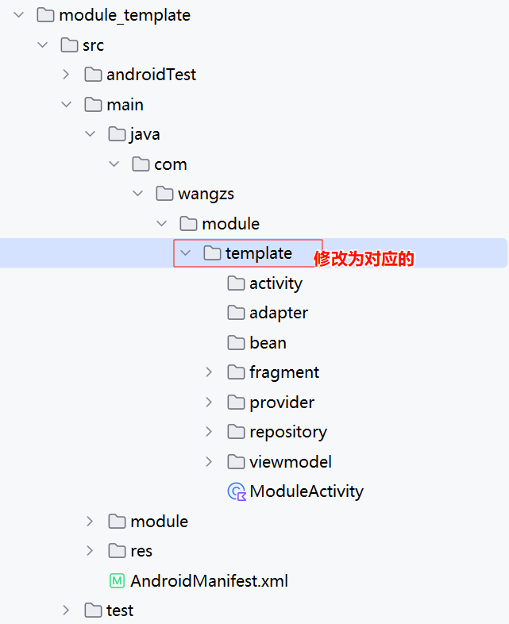

# 这是一个模块的模板
## 使用方式

1. 将本文件夹全部拷贝一份，module_template修改为你具体的模块名称，例如：module_login
2. 修改模块包名
    1. 
    2. build.gradle 中 applicationId "com.wangzs.module.template"
    3. AndroidManifest 中 package="com.wangzs.module.template" 需要改为对应的
    4. 将模块中的Modulexxxx 替换为对应的模块名称 例如ModuleActivity->LoginActivity
3. 检查当前模块是否包含 template 字样，有的话全局替换当前模块